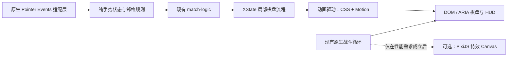

# 游戏运行时渐进升级调研与选型

> 调研快照：2026-07-22<br>
> 范围：拖拽交换、棋盘动画、战斗动画、任务调度、状态编排与 2D 游戏框架。<br>
> 本文先记录审计与选型；2026-07-22 已按风险边界完成阶段 0–3，阶段 4–5 仍只保留为讨论项。

## 结论摘要

迁移前，游戏的拖拽交换、动画、渲染和主循环都是原生实现。Vite 只负责构建，项目没有使用 React、Vue、Phaser、PixiJS、手势库或动画库，生产依赖为零。迁移后依赖变化见下方实施结果与 [`package.json`](../package.json)。

推荐采用以下路线：

1. 保留原生 Pointer Events 作为拖拽输入层，并把项目特有的邻格、轴向、阈值、缩放和边缘规则提取为纯函数。通用手势库不能替代这些游戏规则。
2. 选择 Motion 作为逻辑耦合动画驱动。无效回弹、交换和投射物已经迁移，简单循环、装饰性特效和状态样式继续保留 CSS 动画。
3. XState 只接管局部棋盘流程，不替代全局 `g.state`。`resolution` 继续保持原存档形状，但现在只由棋盘 actor 投影写入。
4. 将 PixiJS 限定为未来的独立特效画布候选。它不接管棋盘按钮、HUD、存档或战斗规则。
5. 将 Phaser 放在最高风险区。除非产品明确需要摄像机、精灵图集、大量粒子、物理或场景编辑器，否则不启动全量 Canvas 重写。

## 实施结果（2026-07-22）

| 阶段 | 状态 | 落地内容 | 回滚点 |
| --- | --- | --- | --- |
| 0：边界与基线 | 已完成 | 新增 `gesture.js` 纯手势模型、单元测试、动画 registry 和浏览器迁移测试 | Pointer Events、DOM 棋盘和原测试钩子保持不变 |
| 1：无效回弹 | 已完成 | `motion/mini` 驱动起始符文回弹，结束或取消后清理 class 与内联 transform | URL 加 `animationDriver=css` 使用原 CSS 路径 |
| 2：交换与投射物 | 已完成 | 交换在 Motion 完成后才提交棋盘；投射物用同一完成事件触发一次伤害；暂停/重开统一进入 registry | 同一 CSS flag 回退交换和投射物旧实现 |
| 3：局部状态机 | 已完成 | XState actor 接管 `idle / swapValidate / swapReverting / resolve*`；存档字段保持兼容 | 范围只在棋盘流程，战斗、HUD、音乐和数值仍是原生状态 |
| 4：PixiJS 特效层 | 未执行，高风险 | 无 | 维持 DOM 特效 |
| 5：Phaser 重写 | 未执行，很高风险 | 无 | 维持现有原生运行时 |

本轮锁定 `motion@12.42.2`、`xstate@5.32.5`，并把 `playwright@1.61.1` 加为开发依赖，使仓库自带浏览器脚本可以直接运行。生产构建主 JS 从 115.22 KB / 37.36 KB gzip 增至 165.51 KB / 54.67 KB gzip，即约增加 50.29 KB / 17.31 KB gzip；这是 Motion 与 XState 合计成本，不包含 Playwright。

验证结果：7 个新单元测试全部通过；Motion 主路径和 CSS 回退路径的真实浏览器测试均通过；生产构建及 Cloudflare 产物检查通过。原有完整 `browser_smoke.js` 顺利执行完拖拽、交换、暂停、存档和迁移相关用例，随后仍在既有的移动端最小字号断言处失败；该失败在运行时代码改动前的基线中已存在，与本次迁移无关。

复审后又补齐了三个边界：交换验证或回退阶段暂停刷新时会正确恢复；session 取消会清除交换节点的临时 class/style；reduced-motion 只降低投射物视觉运动，不提前伤害结算。对应回归同时覆盖 Motion 主路径和 CSS 回退路径。连锁结算完成卡片的停留时间从 1050ms 缩短为 650ms，方便玩家更快回到棋盘操作。

`npm audit` 仍报告 3 个 high，链路是开发依赖 `wrangler → miniflare → sharp < 0.35.0`，当前无自动修复版本；Motion、XState 和 Playwright 没有进入该漏洞链路。

## 迁移前实现审计

### 总体架构

[`src/game/runtime.js`](../src/game/runtime.js#L23) 按依赖顺序调用多个 `attachX()` 模块，并把跨模块方法挂到共享对象 `g`。这种结构是自研运行时组合方式，不是第三方游戏框架。

| 领域 | 当前实现 | 审计结论 |
| --- | --- | --- |
| 构建与入口 | Vite 加原生 ES Modules | Vite 是构建工具，不是游戏框架。 |
| 棋盘渲染 | 每次渲染创建 49 个原生 `button`，再用 `replaceChildren()` 更新 DOM | 完全原生；保留了点击、焦点和 ARIA 语义。见 [`board.js`](../src/game/board.js#L41)。 |
| 拖拽输入 | `pointerdown/move/up/cancel`、`setPointerCapture()`、`touch-action: none` | 完全原生；统一处理鼠标、触摸和笔。见 [`events.js`](../src/game/events.js#L8) 与 [`styles.css`](../styles.css#L497)。 |
| 交换规则 | 自研方向判断、阈值、邻格选择、预览进度、无效回弹 | 完全原生，而且包含较多项目特有语义。见 [`board.js`](../src/game/board.js#L242)。 |
| 消除逻辑 | 纯数组与集合运算 | 已经与 DOM 分离，适合继续保留。见 [`match-logic.js`](../src/game/match-logic.js)。 |
| 棋盘动画 | CSS class、CSS 变量、`transform`、强制样式刷新和可暂停等待 | 完全原生；动画完成时间与业务状态耦合。见 [`board.js`](../src/game/board.js#L117)。 |
| 视觉特效 | 47 组 CSS `@keyframes`，动态创建粒子、投射物和提示元素 | 完全原生；大部分属于低价值的装饰性动画替换目标。见 [`styles.css`](../styles.css#L1209)。 |
| 战斗循环 | `requestAnimationFrame()`、帧间隔上限、DOM 绝对定位 | 完全原生；结构简单，当前没有物理引擎需求。见 [`combat.js`](../src/game/combat.js#L349)。 |
| 延时任务 | 自研可暂停 `setTimeout()` 调度器 | 完全原生；负责动画、伤害与特效清理。见 [`tasks.js`](../src/game/tasks.js#L5)。 |
| 暂停 | 暂停任务、调整时间戳、停止音乐，并用 CSS 暂停所有 keyframes | 暂停语义跨越多个层次，任何动画库都必须接入同一生命周期。见 [`ui.js`](../src/game/ui.js#L37) 与 [`styles.css`](../styles.css#L124)。 |
| 状态 | 自研 `g.state` 加 `resolution` 阶段字段 | 不是状态管理框架；保存与恢复依赖这些字段。见 [`state.js`](../src/game/state.js#L4)。 |
| 响应式布局 | CSS 加自研缩放和方向锁定 | 拖拽坐标会按当前缩放比例换算。见 [`layout.js`](../src/game/layout.js#L7)。 |

### 原实现的优点

- Pointer Events 与 `setPointerCapture()` 已经是浏览器广泛支持的统一输入标准。MDN 将 Pointer Events 标记为 Baseline Widely available，并说明捕获会持续到释放或 `pointerup/pointercancel`。[PointerEvent 文档](https://developer.mozilla.org/en-US/docs/Web/API/PointerEvent)
- 棋盘逻辑和战斗公式已经拆成纯函数模块。引入库时不需要改写三消算法和数值公式。
- DOM 棋盘使用按钮和 ARIA 标签。Canvas 重写会失去这些现成功能，并需要重新实现键盘、读屏和自动化定位。
- 浏览器回归脚本已经覆盖短点击、边界拖动、方向迟滞、双向交换、无效回弹、交换动画和状态锁定。见 [`tests/browser_smoke.js`](../tests/browser_smoke.js#L169) 与 [`tests/browser_smoke.js`](../tests/browser_smoke.js#L523)。
- 动画主要修改 `transform` 和 `opacity`，符合浏览器合成阶段的性能建议。[web.dev 动画性能指南](https://web.dev/articles/animations-guide)

### 原实现的主要维护成本

- [`board.js`](../src/game/board.js) 同时承担棋盘渲染、手势、动画、消除编排、奖励和粒子特效，文件已达到 831 行。领域边界虽然存在，但该模块内部仍然偏重。
- 交换与消除使用“加 class → 强制读取 `offsetWidth` → 等固定毫秒数”的方式同步业务状态。CSS 时长和 JavaScript 时长需要人工保持一致。
- `scheduleGameTask()`、CSS `animation-play-state` 和 `requestAnimationFrame()` 分别管理三套时间语义。后续增加动画时容易遗漏暂停、取消或重开战局。
- 投射物视觉通过 CSS 动画移动，实际伤害通过同样时长的定时任务结算。两条时间线存在漂移和维护重复的可能。
- `renderBoard()` 在多个阶段整体重建 49 个按钮。当前规模很小，不构成引入虚拟 DOM 或 Canvas 的理由，但动画库必须避免持有已经被替换的旧元素。

## 候选库快照

下表中的版本、下载量和发布日期来自 2026-07-22 的 npm 页面快照。下载量只能证明使用范围，不能单独证明技术质量。

| 候选 | 快照信号 | 许可 | 与本项目的匹配度 | 结论 |
| --- | --- | --- | --- | --- |
| [Motion 12.42.2](https://www.npmjs.com/package/motion) | 约 1,476 万周下载，1,795 个依赖项目，18 天前发布 | MIT | 原生 JavaScript、可等待、可暂停、可取消，`motion/mini` 官方标称 2.3 KB | **已选择并实施** |
| [Anime.js 4.5.0](https://www.npmjs.com/package/animejs) | 约 75.8 万周下载，1 个月前发布 | MIT | Vanilla JS、WAAPI 与 JavaScript 双引擎，功能完整 | 可靠备选，但不与 Motion 同时引入 |
| [GSAP 3.13.0](https://www.npmjs.com/package/gsap) | 约 107 万周下载，成熟时间线与插件生态 | Standard “no charge” license | 功能最强，但当前需求用不到高级插件，许可不是 MIT | 暂不选择；复杂动效需求出现后再评估 |
| [`@use-gesture/vanilla` 10.3.1](https://www.npmjs.com/package/%40use-gesture/vanilla) | 约 2.4 万周下载，31 个依赖项目，约两年前发布 | MIT | 支持 drag、阈值、轴和 pointer capture | 不替换当前手势；只保留未来验证资格 |
| [interact.js 1.10.27](https://www.npmjs.com/package/interactjs) | 约 50.6 万周下载，541 个依赖项目，约两年前发布 | MIT | 拖拽、吸附、限制和惯性完整，但明显超出相邻交换需求 | 不选择 |
| [XState 5.32.5](https://www.npmjs.com/package/xstate) | 约 385 万周下载，3 天前发布 | MIT | 适合显式描述异步状态和 actor 生命周期 | **已选择，只迁移棋盘流程** |
| [PixiJS 8.19.0](https://www.npmjs.com/package/pixi.js) | 1,175 个依赖项目，版本持续发布 | MIT | 成熟 2D 渲染器，适合大量粒子和精灵 | 高风险候选，只做独立特效层 |
| [Phaser 4.2.1](https://www.npmjs.com/package/phaser) | 项目有十年以上历史，但 v4 在 2026 年 4 月才正式发布 | MIT | 完整场景、输入、Tween、资源、声音和游戏循环 | 最高风险；不用于近期渐进升级 |

## 分领域选型

### 拖拽交换：保留原生 Pointer Events

浏览器已经提供本项目所需的底层统一能力。当前代码还在它之上实现了以下业务语义：

- 只接受主指针和鼠标左键。
- 根据斜向位移判断主轴，并用迟滞避免方向抖动。
- 只允许选择当前格的上下左右邻格。
- 处理游戏整体缩放后的指针距离。
- 对棋盘边缘施加有限阻尼，不选择不存在的邻格。
- 达到阈值后锁定目标，松开才提交交换。
- 无效交换只回弹起始符文，不改变目标格和棋盘数据。
- 短按继续走可访问的点击选择流程。

`@use-gesture/vanilla` 提供 Vanilla JS 的 `DragGesture`，并支持 `axis`、阈值与 pointer capture。[手势文档](https://use-gesture.netlify.app/docs/gestures/) [选项文档](https://use-gesture.netlify.app/docs/options/) 这些能力只能替换事件归一化，无法替换上面的相邻交换语义。interact.js 同样提供 `lockAxis` 和限制器，但它面向通用拖动、缩放、吸附和惯性，范围更大。[interact.js draggable 文档](https://interactjs.io/docs/draggable/)

推荐先把手势逻辑从 `board.js` 提取为纯的“位移输入 → 手势状态”函数，并让 DOM 适配层继续使用 Pointer Events。只有出现以下任一需求时，才重新开启手势库试验：

- 需要多指或缩放手势。
- 需要惯性、速度、吸附或复杂边界。
- 需要在棋盘之外复用至少三类手势。
- 实测发现需要维护大量浏览器输入兼容分支。

SortableJS 和 HTML Drag and Drop API 不适合本项目。它们主要解决列表重排或通用 DOM 拖放，而本项目要求“仅相邻、仅有效消除、松开提交、无效回弹”，且需要同时保留点击语义。

### 动画：选择 Motion，保留 CSS 共存

Motion 的 `animate()` 同时提供原生 JavaScript API、硬件加速路径、Promise-like 完成通知以及 `pause()`、`play()`、`cancel()` 和 `stop()` 控制。官方提供 2.3 KB 的 `motion/mini` 和 18 KB 的 hybrid 版本。[Motion `animate()` 文档](https://motion.dev/docs/animate) Web Animations API 本身也已经广泛可用，`Element.animate()` 自 2020 年起达到跨浏览器 Baseline。[MDN `Element.animate()`](https://developer.mozilla.org/en-US/docs/Web/API/Element/animate)

推荐使用分层策略：

- CSS 继续负责 hover、选中态、持续循环、简单进入/退出和纯装饰动画。
- `motion/mini` 先负责需要 JavaScript 等待结果的 `transform/opacity` 动画。
- 只有需要独立的 `x/y`、CSS 变量、弹簧或复杂时间线时，才切换到 hybrid import。
- 所有 Motion 控制对象必须进入统一 registry。暂停时调用 `pause()`，恢复时调用 `play()`，重开或 session 变化时调用 `cancel()`。
- `prefers-reduced-motion` 继续作为动画降级入口。业务完成事件不能依赖视觉动画一定播放完整。

第一项试点选择“无效拖拽回弹”。该动画不修改棋盘数据，失败时可以直接回退为当前 CSS class，实现风险最低。第二项才迁移有效交换；第三项才考虑投射物和伤害结算。不要批量重写 47 组 CSS keyframes。

Anime.js v4 也是合格的 MIT 备选，并明确提供 WAAPI 和 JavaScript 双路径。[Anime.js WAAPI 取舍说明](https://animejs.com/documentation/web-animation-api/when-to-use-waapi/) Motion 在本项目中胜出，是因为它的当前使用规模更大、`motion/mini` 路径更清晰，而且动画控制对象正好匹配现有暂停和等待需求。GSAP 的时间线和插件能力很强，但本项目当前不需要它的复杂度，也没有必要引入另一套非 MIT 许可模型。

### 状态编排：XState 只接管棋盘流程

当前 `resolveBoard()` 使用 `async/await` 驱动 `primed → burst → dropping → matching`，同时依赖 `sessionId` 取消旧流程。逻辑可以工作，但暂停、恢复、存档与动画驱动都需要理解这些隐式顺序。

XState v5 用 state machine 和 actor 显式描述状态、事件、guard、delay 与异步 actor。[XState 文档](https://stately.ai/docs) Invoked actor 在进入状态时启动，在离开状态时停止，适合管理动画完成或延时任务。[XState invoke 文档](https://stately.ai/docs/invoke)

推荐只为棋盘解析建立局部机器，不迁移整个 `g.state`：

```text
idle → validating → committing | reverting
                    ↓
                  primed → burst → dropping → matching → idle
```

第一阶段让机器只在测试模式下“影子运行”，比较它的状态与 `g.state.resolution`，不执行副作用。比较稳定后，才能让它成为棋盘解析阶段的唯一权威。战斗敌人数组、HUD、音乐、存档数据和数值公式继续留在现有模块。

### 2D 渲染：PixiJS 只作为独立特效层候选

PixiJS 是成熟的 2D 场景图和 GPU 渲染器。官方 v8 文档将 WebGL/WebGL2 标为稳定且推荐，将 WebGPU 标为仍在成熟中的实验路径。[PixiJS renderer 文档](https://pixijs.com/8.x/guides/components/renderers) PixiJS 自带 ticker，而当前游戏也已经有 `requestAnimationFrame()` 主循环。[PixiJS render loop](https://pixijs.com/8.x/guides/concepts/render-loop)

如果未来出现粒子数量、DOM 节点数量或滤镜性能瓶颈，可以在 `.board-effects` 或战场特效层内挂一个透明 PixiJS Canvas。试点只渲染火花、爆炸或投射物，输入和业务状态仍由原生 DOM 运行时控制。

不要在同一阶段迁移棋盘符文、敌人、HUD 和输入。两个 ticker 并存会产生时钟漂移、重复暂停和额外耗电；试点必须让 Pixi ticker 跟随现有游戏生命周期，或直接由现有主循环驱动 Pixi 渲染。

### 完整游戏框架：Phaser 只适合重写决策

Phaser 提供场景、输入、Tween、资源加载、声音、摄像机、粒子和游戏循环。官方文档说明 Scene 拥有自己的输入、Tween、显示列表和生命周期，而 Game 管理全局 timestep 等系统。[Phaser Scene 文档](https://docs.phaser.io/phaser/concepts/scenes)

这些能力会与当前运行时重复，而不是简单包裹现有模块。当前 DOM 棋盘、ARIA、CSS 布局、存档恢复、暂停任务和浏览器测试都需要重新接线。Phaser v4 又刚完成渲染器、Filter、Camera 和 Shader 等大范围改造，官方变更记录明确列出多个 breaking changes。[Phaser v4 变更记录](https://github.com/phaserjs/phaser/blob/master/changelog/v4/4.0/CHANGELOG-v4.0.0.md)

因此，Phaser 不是本项目当前的渐进式依赖。只有在确认要把主要玩法整体迁移到 Canvas，并且新增功能确实依赖完整引擎时，才建立独立原型并重新做框架选择。选择 Phaser 3 会立即产生向 v4 迁移的技术债；选择刚发布的 Phaser 4 又不符合“最低技术风险”目标。

## 推荐的目标边界



新增模块仍遵循项目的 `attachX()` 约定，并通过 `g.xxx` 跨模块调用。建议的边界如下：

- `src/game/gesture.js`：纯手势状态更新，不读写 DOM 或三消数据；Pointer Events 适配仍在 `board.js` / `events.js`。
- `src/game/animation.js`：CSS/Motion 驱动、活动动画 registry、暂停、恢复、取消和 reduced-motion 策略。
- `src/game/board-flow.js`：XState actor、流程事件、历史快照和原 `resolution` 存档形状投影。
- `src/game/effects-renderer.js`：未来的 DOM/Pixi 特效适配层；默认仍为 DOM。

不要改名 `window.__runeRampartTest` 或现有 localStorage key。不要把原生游戏主循环改成 React 或 Vue 组件。

## 按风险递增的迁移路线

### 阶段 0：建立边界和基线（已完成）

**风险：很低。生产依赖：无。**

1. 把手势状态计算从 `board.js` 提取为纯函数，但保持 Pointer Events 绑定和行为不变。
2. 增加动画驱动接口，默认实现继续调用当前 CSS class 和 `g.wait()`。
3. 给活动动画定义统一的暂停、恢复和取消生命周期；session 变化时取消全部旧控制对象。
4. 为纯手势函数增加方向、缩放、边缘、阈值和反向迟滞测试。
5. 记录当前构建产物体积、关键截图和拖拽交换时序。

验收要求：迁移相关浏览器 smoke 通过；原测试钩子和存档字段保持兼容，CSS 类与视觉结果不变。该阶段可以独立回滚，不触及游戏规则。

### 阶段 1：Motion 无效回弹试点（已完成）

**风险：低。生产依赖：Motion 一个。**

1. 安装并锁定 Motion 12 的兼容版本，首选 `motion/mini` import。
2. 只替换 `animateRejectedRuneDrag()`，保留当前 CSS 实现作为 feature flag 后备。
3. 验证鼠标和触控指针、游戏缩放、暂停中断、重开取消、页面隐藏和 reduced motion。
4. 对比构建产物；初始试点的 gzip 增量预算建议不超过 10 KB。

验收要求：无效拖拽期间棋盘数组完全不变；只移动起始符文；动画结束后没有内联 transform、活动控制对象或临时 class 泄漏。

### 阶段 2：Motion 接管交换和逻辑耦合动画（已完成）

**风险：低到中。**

1. 迁移有效交换和点击交换，让棋盘数据只在动画成功完成后提交。
2. 迁移取消、回退和 session 失效路径。
3. 评估投射物动画是否可以用统一完成事件结算伤害，消除“CSS 时长 + 定时任务时长”的重复来源。
4. 简单循环和装饰 keyframes 继续留在 CSS。

验收要求：暂停后画面和伤害结算同时冻结；恢复后只结算一次；重开或读档不会让旧动画修改新 session；点击交换与拖拽交换保持对称。

### 阶段 3：XState 局部棋盘状态机（已完成）

**风险：中。生产依赖：条件增加 XState。**

1. actor 记录状态历史，并把快照映射到原有 `g.state.resolution` 存档结构。
2. `resolution` 的直接写入已收敛到 `board-flow.js`；棋盘模块只发送事件。
3. 正常消除、连续消除、无效交换、暂停、重开、读档恢复继续复用原业务副作用。
4. 没有迁移整个 `g.state`，也没有把敌人建成 actor。

验收要求：状态机快照可以映射回现有存档字段；任何时刻只有一个权威状态源；旧 session 的 actor 和动画全部停止。

### 阶段 4：PixiJS 独立特效层试验

**风险：高。默认不执行。**

启动条件必须来自测量，而不是代码风格偏好：大量粒子导致帧率下降、DOM 节点或 paint 成为明确瓶颈，或者产品需要 WebGL 滤镜和精灵批处理。

试验只允许迁移一种无交互特效，例如符文火花。使用稳定的 WebGL renderer，不启用仍在成熟中的 WebGPU。Canvas 必须可以一键移除，并自动回退到现有 DOM 特效。

验收要求：不存在第二套业务主循环；暂停和页面隐藏时 ticker 停止；Canvas 上下文丢失后游戏仍可继续；低性能设备使用 DOM 或降低特效。

### 阶段 5：Phaser 原型或整体重写

**风险：很高。默认不执行。**

只有以下条件同时满足时才进入讨论：

- 路线图明确需要完整游戏引擎能力，而不是单个动画或特效能力。
- 团队接受重新实现棋盘可访问性、缩放、暂停、存档恢复和浏览器测试。
- 团队接受 Canvas 与 DOM 混合期的双运行时成本。
- 独立原型证明收益大于 PixiJS 特效层或现有 DOM 优化。
- 已决定采用 Phaser 4，并接受其新主版本观察期与后续升级成本。

## 高风险项清单

| 风险 | 影响 | 缓解与决策门 |
| --- | --- | --- |
| 动画完成与业务提交失去同步 | 重复消除、错位、伤害提前或永久锁盘 | 所有逻辑耦合动画必须返回可等待结果，并支持取消；session 变化后结果失效。 |
| 暂停出现多套时钟 | CSS、Motion、定时任务、RAF 或 Pixi ticker 恢复时间不一致 | 用单一生命周期接口控制所有活动动画；每阶段增加暂停中途测试。 |
| 整体重建棋盘使动画引用失效 | Motion 控制对象继续指向已经移除的按钮 | 动画完成或取消后再 `replaceChildren()`；registry 自动清理断开连接的节点。 |
| DOM 与 Canvas 坐标系统不同 | 缩放、DPR、全屏和横屏下特效偏移 | 共享逻辑坐标，集中处理 `--game-scale`、设备像素比和 resize。 |
| Canvas 破坏可访问性 | 键盘操作、ARIA、焦点和自动化定位丢失 | 棋盘和 HUD 保持 DOM；只有非交互特效可以先进入 Canvas。 |
| 双主循环 | 重复计算、漂移、耗电和页面隐藏后继续运行 | Pixi/Phaser 试点不得拥有独立业务时钟；先定义唯一 clock owner。 |
| XState 与 `g.state` 双写 | 状态分歧、存档不可恢复 | 已把 `resolution` 直接写入收敛到 actor 投影；后续代码只发送棋盘流程事件。 |
| Phaser 4 主版本较新 | API、插件和教程生态仍在从 v3 迁移 | 观察稳定性；不要为“以后可能需要”提前引入。 |
| 依赖增加但收益不明确 | 构建体积、供应链和升级成本上升 | 每个库必须由一个独立试点证明收益；不同时引入同类库。 |
| 视觉迁移缺少确定性 | 看似通过但拖拽手感或动画节奏回退 | 保留关键截图、PointerEvent 时序断言和真实鼠标拖拽用例。 |

## 每个阶段的统一验收门

每个迁移阶段必须可独立验证，并满足以下条件后才能进入下一阶段：

1. `npm run build` 成功，Cloudflare Pages 产物校验通过。
2. `tests/browser_smoke.js` 的桌面、横屏、拖拽、暂停、存档和结算用例全部通过。
3. `window.__runeRampartTest` 的公开形状与 localStorage key 不变。
4. 点击交换、拖拽交换、无效回弹、连续消除和中途暂停都有自动化断言。
5. 记录构建体积与关键路径帧表现，不能只凭主观顺滑判断。
6. 新路径带有明确后备实现或小范围回滚点。
7. 不在同一个阶段同时更换输入库、动画库和渲染框架。

## 后续决策

阶段 0–3 已完成。建议至少观察一个发布周期的错误率、暂停/恢复反馈和低端设备表现，不继续扩大动画迁移范围。阶段 4 和阶段 5 仍只保留在风险清单中，不进入实现排期；只有获得明确的性能数据或产品能力需求后再讨论。

这条路线保留了当前项目最有价值的资产：纯三消逻辑、DOM 可访问性、已有拖拽手感、暂停和存档语义，以及现有浏览器回归脚本。同时，它把最容易出错的动画完成与取消语义逐步收敛到成熟工具上，而不是一次性重写整个游戏。
